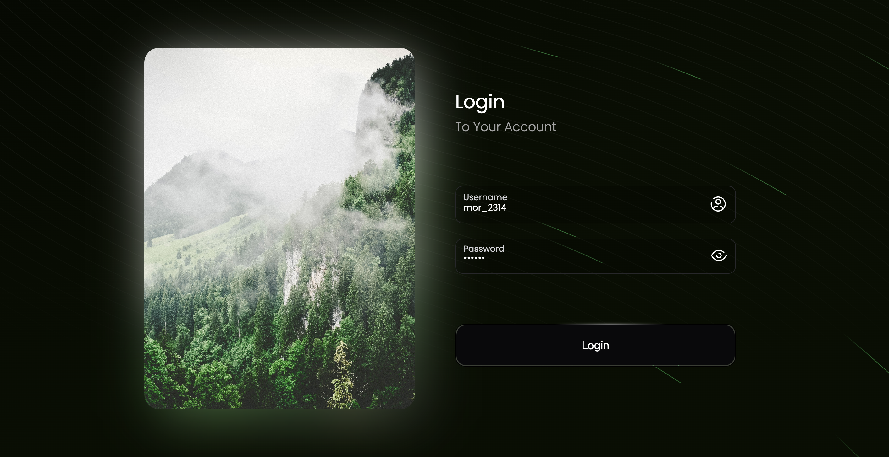
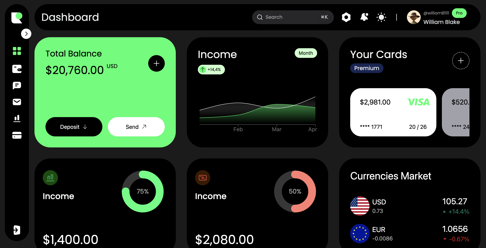
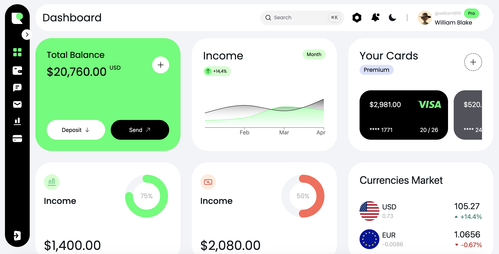
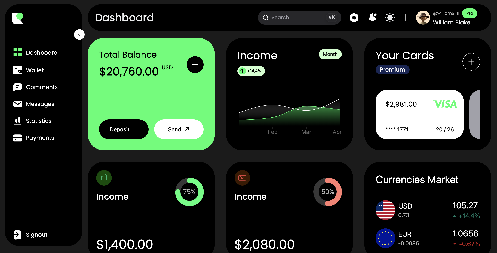
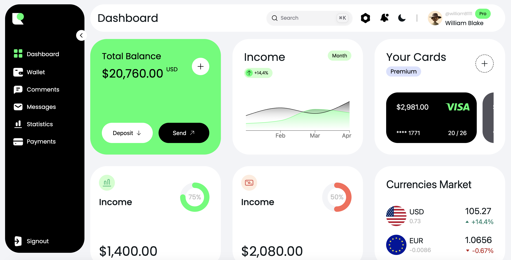
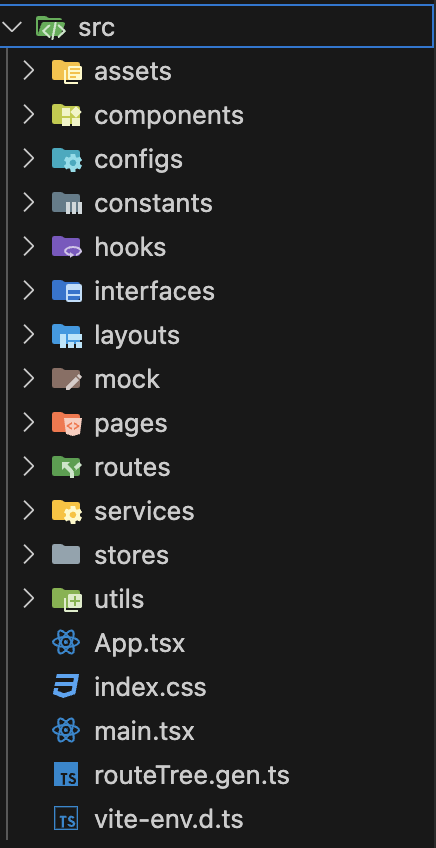

# NextUI-Dashboard (Starter Version)

**Glad you chose us to develop your project.**

## Skills

- React.js
- Typescript
- Tanstack/react-router
- Next-UI
- Farmer-motion
- Tailwind
- Tanstack/react-query
- axios
- clsx
- js-cookie
- react-hot-toast
- Zustand
- react-hook-form
- react-helmet
- recharts
- react-i18next

## Run Project

First of All for running the project you should do these three steps:

```
git clone https://github.com/aryankholqi/nextUI-Dashboard.git
```

```
cd nextUI-Dashboard
pnpm install
```

```
pnpm run dev
```

ok... the project is running on your local.

## Login

At first you face the login page, because the nature of dashboard panels, which is **authenticated**:



> We've used **fakestoreapi** login api to get an access token for working like a real authorization scenarios **(Note that you should always login with this username and password to access to dashboard )**. We've managed token with **js-cookie** library.

## Dashboard (Home)

well, when you successfully logged in, you'll face the dashboard layout which we really love it:









## Folder Structure



> We want to go straight forward to src folder:

- **assets** => includes all **icons** and **images** we've been used in the project
- **components** => All sections are devided into **template/module** component:
  1. **Templates**: All components which are only used only in **a single route** (page)
  2. **Modules**: All components which are used at least in 2 routes or **entire the project** (like Sidebar, Topbar)
- **configs** => libraries like **tanstack/router**, **tanstack/query ** , ... have default configs that you can customize them, in here we customized **createRouteFile** of tanstack/router for handling if user is authenticated to navigate through our authorized routes.
- **constants** => nothing to explain. so easy XD
- **hooks** => in here we developed some custom hooks which is used by components:
  1. api: for each api we've developed a custom tanstack/query hook to manage api call and we used it inside the component which that api should be called
- **interfaces** => yeaaah. the project is **typescript** supported. we've managed all interfaces that we needed here.
- **layouts** => as you might noticed this project has 2 different layouts. one for Login and the other one is for the whole dashboard. so we have **AuthLayout.tsx** for Login route and **DashboardLayout.tsx** for all other routes (authorized ones)
- **mock** => for some components which need data from api, we simulated it as mock but it's not an api, it's just a function which returns the data the component wants
- **pages** => each route means a page to us. so for each page we've created a folder in here, its name is matched by the pathname of the url. (we've treated like next.js pages route here XD)
- **routes** => if you've never worked with tanstack/router, don't worry! the routing system is as easy as it is. for each route you wanna create, you should just create a file matched with the name of the route. it will automatically do the things for you ;)
- **services** => the api requests all are in here. we've developed an axios interceptor called **httpService** to handle the requests.
- **stores** => for managing the global states like **isSidebarExpanded** we've used **zustand**, all states and the reducers handled here.
- **utils** => some functions which may be used in different components. so we've developed them here. like **isAuthenticated function**
